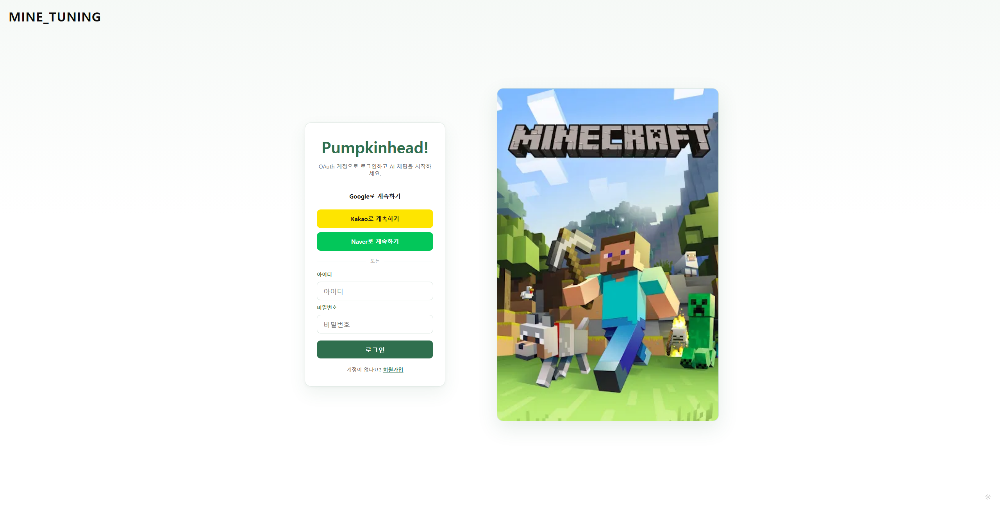
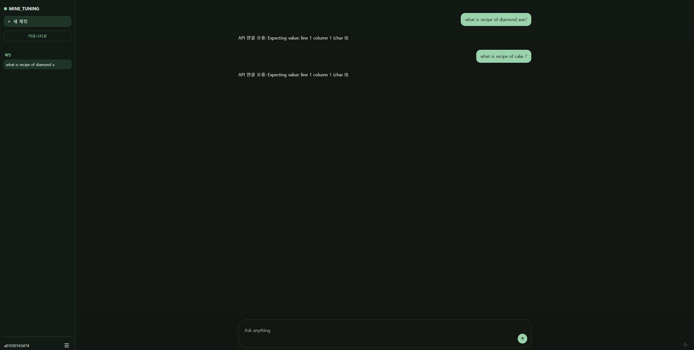
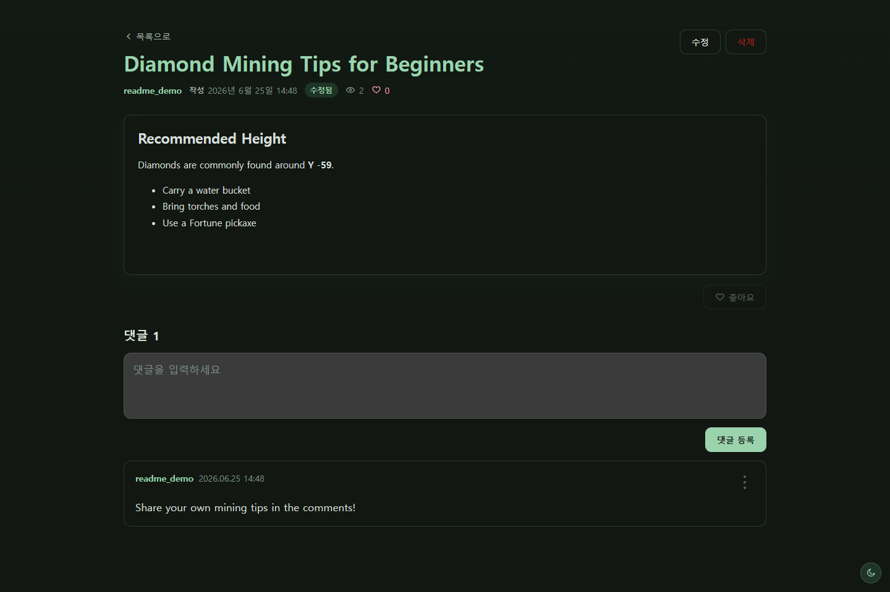

# MINE_TUNING

Minecraft 관련 질문을 AI에게 묻고, 사용자들과 공략과 팁을 공유할 수 있는 Django 웹 애플리케이션입니다.

AI 채팅, 채팅 기록 관리, OAuth 로그인, 마크다운 커뮤니티, 인기 게시글, 댓글과 좋아요, 라이트·다크 테마를 하나의 서비스에서 제공합니다.

## 주요 화면

### 로그인



일반 계정 로그인과 Google, Kakao, Naver OAuth 로그인을 지원합니다. 설정되지 않은 OAuth 공급자는 화면에 표시하지 않습니다.

### AI 채팅



Minecraft 질문을 입력하면 외부 AI API의 답변을 대화 형태로 확인할 수 있습니다. 입력창은 내용에 맞춰 자동으로 높이가 조절되며 라이트·다크 테마를 지원합니다.

### 커뮤니티 게시글



마크다운으로 공략을 작성하고 댓글과 좋아요로 다른 사용자와 정보를 공유할 수 있습니다.

## 주요 기능

### 계정과 인증

- 아이디와 비밀번호를 이용한 회원가입 및 로그인
- Google, Kakao, Naver OAuth 로그인
- 동일 이메일의 일반 계정과 소셜 계정 자동 연결
- 로그인 실패와 회원가입 검증 메시지 표시
- 로그아웃
- 회원 탈퇴 시 사용자의 채팅, 게시글, 댓글 등 연관 데이터 삭제
- 로그인 완료 후 AI 채팅 화면으로 이동

### AI 채팅

- 새로운 채팅방 생성
- 외부 Minecraft AI API에 질문 전송
- 사용자 질문과 AI 답변을 시간순으로 저장
- 답변 생성 중 로딩 상태 표시
- Enter로 전송, Shift+Enter로 줄바꿈
- 입력 내용에 따라 채팅 입력창 높이 자동 조절
- 최대 높이 이후 입력창 내부 스크롤
- 응답 대기 중 작성한 초안 보존
- 채팅 화면 진입 시 최신 메시지 위치로 자동 스크롤
- 키보드 입력 시 채팅 입력창으로 자동 포커스

### 채팅 기록 관리

- 첫 질문을 기준으로 채팅방 제목 생성
- 최근 메시지 활동 순으로 채팅방 정렬
- 채팅방 이름 변경
- 채팅방 즐겨찾기 및 즐겨찾기 해제
- 즐겨찾기 채팅을 일반 채팅보다 위에 표시
- 채팅방 전체 삭제
- 사용자 질문 수정
  - 수정한 질문 이후의 기존 대화를 제거
  - 수정된 질문으로 AI 답변을 다시 생성
- 사용자 질문 삭제
  - 선택한 질문과 이후의 AI 답변 및 후속 질문을 모두 삭제
  - 첫 번째 질문을 삭제하면 채팅방 전체 삭제
- 다른 사용자의 채팅방과 메시지 접근 차단

### 커뮤니티

- 게시글 목록 및 상세 조회
- 게시글 작성, 수정, 삭제
- 작성자, 작성일, 수정 여부, 조회수, 좋아요 수 표시
- 본인 게시글에 대한 수정·삭제 권한 제한
- 본인 게시글 좋아요 방지
- 좋아요 및 좋아요 취소를 비동기로 반영
- 댓글 작성, 수정, 삭제
- 댓글 작성자만 수정·삭제 가능
- 비로그인 사용자의 읽기 허용
- 글 작성, 댓글, 좋아요 등 변경 작업은 로그인 필요

### 마크다운 에디터

- 제목, 강조, 목록, 링크, 이미지 등 마크다운 문법 지원
- 게시글 상세 화면에서 마크다운 HTML 렌더링
- `bleach`를 이용한 위험한 HTML과 프로토콜 제거
- 이미지 드래그 앤 드롭 업로드
- 클립보드 이미지 붙여넣기 업로드
- 업로드한 이미지의 마크다운 문법 자동 삽입
- JPEG, PNG, GIF, WEBP 지원
- 최대 이미지 크기 5MB 제한
- 확장자뿐 아니라 실제 파일 시그니처 검증

### 인기 게시글

- 조회수와 좋아요 수를 합산한 인기 점수
- 실시간, 주간, 월간, 연간 기간 필터
- 메인 커뮤니티 화면에 인기 게시글 미리보기
- 별도의 인기 게시글 목록 화면
- 점수, 좋아요, 작성일을 기준으로 정렬

### UI 및 접근성

- 라이트 모드와 다크 모드
- 선택한 테마를 `localStorage`에 저장
- 시스템 테마를 초기값으로 사용
- 모바일 화면 대응
- 메뉴의 `aria-label`, `aria-expanded`, 로딩 상태 제공
- 삭제 작업 전 확인창 표시
- 모션 감소 설정 사용 시 로딩 애니메이션 비활성화

## 기술 스택

| 구분 | 기술 |
| --- | --- |
| Backend | Python, Django 5.2 |
| Database | SQLite (개발), PostgreSQL (배포) |
| Authentication | Django Auth, django-allauth |
| Frontend | Django Template, HTML, CSS, JavaScript ES Modules |
| Markdown | Python-Markdown |
| HTML Sanitizing | Bleach |
| Image Storage | Django File Storage |
| External API | Minecraft AI/RAG API |
| Test | Django TestCase |
| Deployment | Render, Gunicorn, WhiteNoise |

## 프로젝트 구조

```text
mine-tuning-web/
├─ accounts/                 # 일반 로그인, 회원가입, OAuth 계정 연동
├─ community/                # 게시글, 댓글, 좋아요, 인기글, 이미지 업로드
├─ mine_chat/                # AI 채팅, 채팅방 및 메시지 관리
├─ mine_tuning/              # Django 프로젝트 설정과 최상위 URL
├─ static/
│  ├─ css/
│  │  ├─ base.css            # 전역 토큰과 공통 스타일
│  │  ├─ chat.css            # 채팅 화면
│  │  ├─ auth.css            # 인증 화면
│  │  ├─ community.css       # 커뮤니티 화면
│  │  └─ styles.css          # CSS 진입점
│  ├─ images/                # 서비스 이미지
│  └─ js/
│     ├─ modules/            # 테마, 메뉴, 채팅, 메시지 수정 모듈
│     ├─ community_markdown.js
│     ├─ community_post_detail.js
│     ├─ theme_bootstrap.js
│     └─ main.js             # JavaScript 진입점
├─ templates/                # 공통 및 OAuth 템플릿
├─ docs/
│  ├─ images/                # README 화면 캡처
│  └─ ERD.md                 # 데이터 모델 문서
├─ build.sh                  # Render 빌드 및 배포 준비 스크립트
├─ render.yaml               # Render Web Service와 PostgreSQL 설정
├─ manage.py
└─ requirements.txt
```

## 설치 및 실행

### 1. 저장소 복제

```bash
git clone <repository-url>
cd mine-tuning-web
```

### 2. 가상환경 생성 및 활성화

Windows PowerShell:

```powershell
python -m venv venv
.\venv\Scripts\Activate.ps1
```

macOS/Linux:

```bash
python3 -m venv venv
source venv/bin/activate
```

### 3. 패키지 설치

```bash
pip install -r requirements.txt
```

### 4. 환경변수 설정

프로젝트 루트에 `.env` 파일을 생성합니다.

```dotenv
# Minecraft AI API
NGROK_URL=https://your-ai-api.example.com

# Google OAuth
GOOGLE_OAUTH_CLIENT_ID=
GOOGLE_OAUTH_CLIENT_SECRET=

# Kakao OAuth
KAKAO_OAUTH_CLIENT_ID=
KAKAO_OAUTH_CLIENT_SECRET=

# Naver OAuth
NAVER_OAUTH_CLIENT_ID=
NAVER_OAUTH_CLIENT_SECRET=
```

OAuth를 사용하지 않는 경우 관련 값을 비워둘 수 있습니다. 값이 없는 OAuth 공급자는 로그인 화면에서 숨겨집니다.

AI 서버는 다음 요청을 처리해야 합니다.

```http
POST {NGROK_URL}/chat
Content-Type: application/json

{
  "question": "Where can I find diamonds?"
}
```

애플리케이션은 응답의 `validation.corrected_answer` 값을 AI 답변으로 사용합니다.

### 5. 데이터베이스 마이그레이션

```bash
python manage.py migrate
```

### 6. 개발 서버 실행

```bash
python manage.py runserver
```

브라우저에서 `http://127.0.0.1:8000/`에 접속합니다.

## 배포

이 프로젝트는 [Render](https://render.com/)를 통해 배포합니다. `render.yaml`에 Django Web Service와 PostgreSQL 데이터베이스 구성을 정의했습니다.

배포 과정은 다음과 같습니다.

1. Render가 `build.sh`를 실행해 Python 패키지를 설치합니다.
2. `collectstatic`으로 정적 파일을 수집합니다.
3. 데이터베이스 마이그레이션을 적용합니다.
4. Gunicorn으로 Django WSGI 애플리케이션을 실행합니다.
5. WhiteNoise가 배포 환경의 정적 파일을 제공합니다.

Render에서 사용하는 주요 환경변수는 다음과 같습니다.

| 환경변수 | 설명 |
| --- | --- |
| `DEBUG` | 배포 환경에서 `False`로 설정 |
| `SECRET_KEY` | Render에서 안전한 값으로 자동 생성 |
| `DATABASE_URL` | Render PostgreSQL 연결 정보 |
| `RENDER_EXTERNAL_HOSTNAME` | 배포 도메인을 허용 호스트와 CSRF 신뢰 출처에 반영 |
| `NGROK_URL` | Minecraft AI/RAG API 주소 |
| `GOOGLE_OAUTH_CLIENT_ID`, `GOOGLE_OAUTH_CLIENT_SECRET` | Google OAuth 설정 |
| `KAKAO_OAUTH_CLIENT_ID`, `KAKAO_OAUTH_CLIENT_SECRET` | Kakao OAuth 설정 |
| `NAVER_OAUTH_CLIENT_ID`, `NAVER_OAUTH_CLIENT_SECRET` | Naver OAuth 설정 |

OAuth 공급자의 개발자 콘솔에는 로컬 주소 대신 Render의 HTTPS 배포 도메인을 사용한 콜백 URL도 등록해야 합니다.

## OAuth 설정

각 OAuth 서비스의 개발자 콘솔에서 애플리케이션을 등록하고 아래 콜백 URL을 등록해야 합니다.

```text
Google: http://127.0.0.1:8000/oauth/google/login/callback/
Kakao:  http://127.0.0.1:8000/oauth/kakao/login/callback/
Naver:  http://127.0.0.1:8000/oauth/naver/login/callback/
```

운영 환경에서는 도메인과 HTTPS 주소에 맞게 변경합니다.

## 테스트

전체 테스트:

```bash
python manage.py test
```

앱별 테스트:

```bash
python manage.py test accounts
python manage.py test mine_chat
python manage.py test community
```

현재 테스트는 다음 영역을 검증합니다.

- 회원가입, 로그인, 로그아웃, 회원 탈퇴
- 채팅 생성, 정렬, 즐겨찾기, 수정, 구간 삭제
- 첫 질문 삭제 시 채팅방 삭제
- 마크다운 렌더링과 HTML 정화
- 게시글 메타데이터와 좋아요 권한
- 기간별 인기 게시글 정렬
- 이미지 형식, 크기, 파일 시그니처 검증
- JavaScript ES 모듈 MIME 타입

## 주요 URL

| URL | 기능 |
| --- | --- |
| `/` | AI 채팅 |
| `/accounts/login/` | 로그인 |
| `/accounts/signup/` | 회원가입 |
| `/oauth/` | OAuth 인증 |
| `/community/` | 커뮤니티 게시글 목록 |
| `/community/new/` | 게시글 작성 |
| `/community/popular/` | 인기 게시글 |
| `/admin/` | Django 관리자 |

## 데이터 모델

핵심 모델은 다음과 같습니다.

- `User`: Django 기본 사용자
- `ChatSession`: 사용자별 채팅방과 즐겨찾기 상태
- `ChatMessage`: 사용자 질문과 AI 답변
- `Post`: 마크다운 게시글, 조회수, 좋아요
- `Comment`: 게시글 댓글
- django-allauth 모델: OAuth 앱, 소셜 계정, 토큰

자세한 관계는 [ERD 문서](docs/ERD.md)를 참고하세요.

## 개발 시 참고사항

- `.env`, SQLite 데이터베이스, 업로드 미디어는 Git에 포함되지 않습니다.
- 개발 환경에서 업로드 파일은 `media/` 아래에 저장됩니다.
- CSS는 역할별 파일로 분리되어 `styles.css`에서 순서대로 불러옵니다.
- JavaScript는 ES 모듈로 구성되어 있으며 `.js` 응답은 `application/javascript` MIME 타입을 사용합니다.
- 이미지 업로드와 외부 API 호출을 운영 환경에서 사용할 경우 저장소, 용량 제한, 타임아웃, 비밀키 관리를 별도로 구성해야 합니다.

---

## 사용 기술 및 라이브러리

**Backend**

`Python` · `Django 5.2` · `SQLite` · `PostgreSQL`

**Frontend**

`HTML5` · `CSS3` · `JavaScript` · `ES Modules` · `Django Template`

**인증**

`Django Authentication` · `django-allauth` · `Google OAuth` · `Kakao OAuth` · `Naver OAuth`

**콘텐츠 및 보안**

`Python-Markdown` · `Bleach` · `Django File Storage`

**통신 및 외부 연동**

`Fetch API` · `REST API` · `Minecraft AI/RAG API`

**테스트 및 개발 환경**

`Django TestCase` · `Git` · `GitHub`

**배포**

`Render` · `Gunicorn` · `WhiteNoise` · `dj-database-url`
