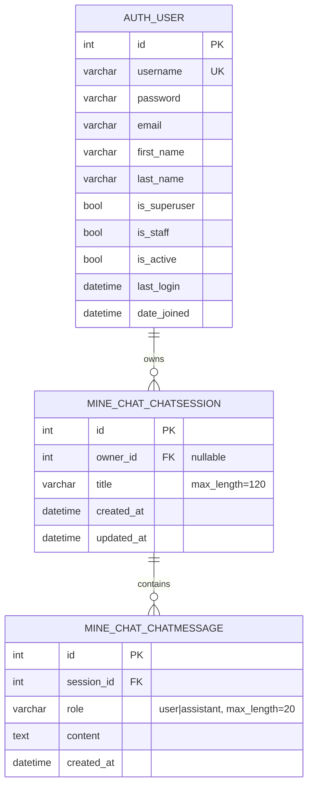
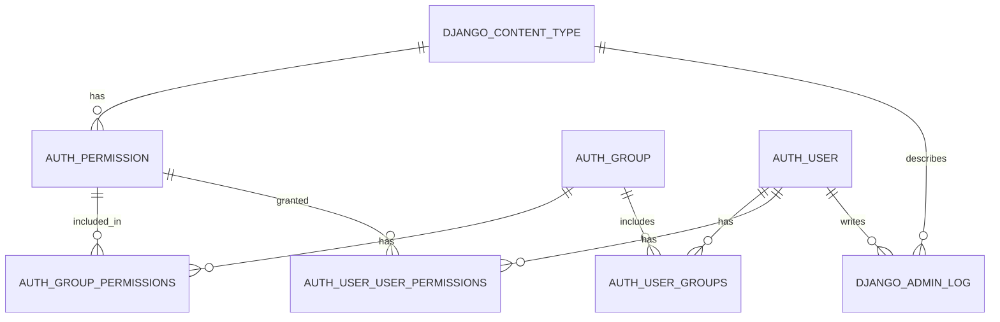

# ERD

현재 프로젝트는 Django 기본 `auth.User` 모델을 사용하고, 커스텀 도메인 모델은 `mine_chat` 앱의 채팅 세션/메시지 2개입니다.

## 핵심 도메인 ERD

## 관계

| From | To | Cardinality | FK | Delete rule |
| --- | --- | --- | --- | --- |
| `auth_user` | `mine_chat_chatsession` | 1:N | `mine_chat_chatsession.owner_id` | `CASCADE` |
| `mine_chat_chatsession` | `mine_chat_chatmessage` | 1:N | `mine_chat_chatmessage.session_id` | `CASCADE` |

## 테이블 상세

### `mine_chat_chatsession`

| Column | Type | Null | Key | Description |
| --- | --- | --- | --- | --- |
| `id` | integer | NO | PK | Django `BigAutoField` |
| `owner_id` | integer | YES | FK | `auth_user.id` 참조 |
| `title` | varchar(120) | NO | | 채팅방 제목 |
| `created_at` | datetime | NO | | 생성 시간 |
| `updated_at` | datetime | NO | | 수정 시간 |

인덱스:

| Name | Columns |
| --- | --- |
| `mine_chat_chatsession_owner_id_56a86a40` | `owner_id` |

### `mine_chat_chatmessage`

| Column | Type | Null | Key | Description |
| --- | --- | --- | --- | --- |
| `id` | integer | NO | PK | Django `BigAutoField` |
| `session_id` | bigint | NO | FK | `mine_chat_chatsession.id` 참조 |
| `role` | varchar(20) | NO | | `user` 또는 `assistant` |
| `content` | text | NO | | 메시지 본문 |
| `created_at` | datetime | NO | | 생성 시간 |

인덱스:

| Name | Columns |
| --- | --- |
| `mine_chat_chatmessage_session_id_fa8d89eb` | `session_id` |

## Django 기본 테이블

현재 SQLite DB에는 Django 기본 앱 테이블도 함께 존재합니다.

대상 테이블:

| App | Tables |
| --- | --- |
| `auth` | `auth_user`, `auth_group`, `auth_permission`, `auth_user_groups`, `auth_user_user_permissions`, `auth_group_permissions` |
| `contenttypes` | `django_content_type` |
| `admin` | `django_admin_log` |
| `sessions` | `django_session` |
| `migrations` | `django_migrations` |
